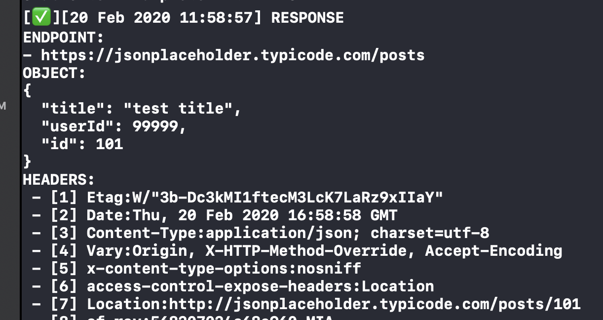

# Simple-Networking

[](https://travis-ci.org/mejiagarcia/simple-networking)
[](https://cocoapods.org/pods/Simple-Networking)
[](https://cocoapods.org/pods/Simple-Networking)
[](https://cocoapods.org/pods/Simple-Networking)

Forget about all serialization logic, mappers and old networking stuff, Simple-Networking is build on top of **URLSession** and **Codable** protocol to make your life easier. 

-  [Example](#example)
-  [Installation](#installation)
-  [Perform GET/POST request](#usage)
-  [Headers](#headers)
-  [Debug Mode](#debug)
-  [SSL Pinning](#ssl-pinning)
-  [Documentation](#documentation)

## Example
To run the example project, clone the repo, open `SimpleNetworking.xcworkspace` and open the Example target.

## Installation
SimpleBinding is available through [CocoaPods](https://cocoapods.org). To install it, simply add the following line to your Podfile:

```ruby

pod 'Simple-Networking'

```

## Usage
```swift
import Simple_Networking
 ```

### Perform a GET request with a Codable result.

**Given the next model:**

1. Success case model.
```swift
struct  User: Codable {
	let title: String
	let userId: Int
}
 ```

Perform your request expecting the given model as the result: 

```swift
// 1. Prepare your endpoint.
let endpoint = "https://jsonplaceholder.typicode.com/todos/1"

// 2. Put your Codable type in the result block, in this example, your type is the *User* model.
SN.get(endpoint: endpoint) { [weak self] (response: SNResult<User>) in
	switch response {
	case .error(let error):
		// 3. Hanlde the possible error.
		print(error.localizedDescription)
		
	case .success(let response):
		// 4. Enjoy your codable result.
		self?.nameLabel.text = response.title // <- Response is your User model.
	}
}
 ```
 
### Perform a GET request with a Codable result and a Codable error.

**Given the next two models:**

1. Success case model.
```swift
struct User: Codable {
	let title: String
	let userId: Int
}
 ```
 
2. Error case model
```swift
struct ServerError: Codable {
	let error: String
	let serverError: String
}
 ```

Perform your request to get the model number 1 in success case or model number 2 in error case:

```swift
// 1. Prepare your endpoint (this particular one has a 404 response).
let endpoint = "http://www.mocky.io/v2/5de68cd33700005a000924a4"

// 2. Put your Codable type in the result block.
SN.get(endpoint: endpoint) { [weak self] (response: SNResultWithEntity<User, ServerError>) in 
	switch response {
	// Regular error
	case .error(let error):
		print(error.localizedDescription)
		
	// Error parsed to your error entity
	case .errorResult(let entity):
		print(entity.error) // <- Entity is ServerError
		print(entity.serverError)
	
	// Regular success
	case .success(let response):
		print(response.title) // <- response is User
	}
}
 ```

### Perform a POST request with a Codable result and a Codable request.

**Given the next model:**

1. Success case and request model.
```swift
struct  User: Codable {
	let title: String
	let userId: Int
}
 ```

Perform your request expecting the given model as the result and sending your model as the request body: 

```swift
// 1. Prepare your endpoint.
let endpoint = "https://jsonplaceholder.typicode.com/posts"

// 2. Prepare your request (Codable model)
let request = User(title: "test title", userId: 99999)

// 2. Make the request
SN.post(endpoint: endpoint, model: request) { [weak self] (response: SNResult<User>) in
	switch response {
	case .error(let error):
		// 3. Hanlde the possible error.
		print(error.localizedDescription)
		
	case .success(let response):
		// 4. Enjoy
		self?.humanNameLabel.text = response.title
	}
}
 ```

## Headers
By default, SimpleNetworking uses `application/json` as the `Content-Type` of every request. You can change this or use your own headers:

```swift
SimpleNetworking.defaultHeaders = [
	"Content-Type": "application/json",
	// Your headers
]
```

### Authentication
We added a helper method to help you add an authentication header (e.g. a JWT Token):

```swift
SimpleNetworking.setAuthenticationHeader(prefix: "Bearer", token: "TOKEN")
```

Calling this method will result in:

```Authentication: Bearer TOKEN```

### Debug
We provide a debug mode in order to see in detail all your requests through the Pod in Xcode console, this is how it works:

1. Check only your API responses:
```swift
SimpleNetworking.debugMode = .onlyResponses
```



2. Check only your API requests:
```swift
SimpleNetworking.debugMode = .onlyRequests
```


3. Check all your requests and responses from your API:
```swift
SimpleNetworking.debugMode = .all
```

By default debug mode is `disabled`.

## SSL-Pinning
We support certificate pinning (available in v0.3.5), we are still working in Public Key pinning support (PR's are welcome). In order to setup your certificate you have to call `setupSSLPinnig` method:

```swift
if let certPath = Bundle.main.path(forResource: "my_cert", ofType: ".der") {
	SimpleNetworking.setupSSLPinnig(certificateFullPath: certPath)
}
```

This method will compare the remote certificate against your local certificate. The remote certificate is obtained from the Host you are targeting in the request.

## Documentation
*SNResult*
```swift
public enum SNResult<T: Codable> {
	case success(response: T)
	case error(error: SNErrors)
}
```

*SNResultWithEntity*
```swift
public  enum  SNResultWithEntity<T: Codable, Y: Codable> {
	case success(response: T)
	case error(error: SNErrors)
	case errorResult(entity: Y)
}
```

*SNResultBlock*
```swift 
public typealias SNResultBlock<T: Codable> = ((_ response: SNResult<T>) -> Void)?
```

*SNResultBlockWithError*
```swift 
public typealias SNResultBlockWithError<T: Codable, Y: Codable> = ((_ response: SNResultWithEntity<T, Y>) -> Void)?
```

*SNErrors*
```swift
public  enum  SNErrors: Error {
	case endpoint
	case badResponse
	case custom(error: Error?)
	case emptyContent
	case unknown(error: String?)
}
```

## Author
Carlos Mejía, carlosmejia083@gmail.com

https://twitter.com/carlosmejia083

## License
SimpleNetworking is available under the MIT license. See the LICENSE file for more info.
